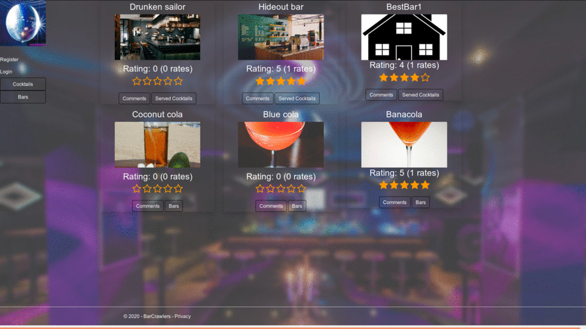

# "BarCrawlers" 
### a Coca-Cola partner project
### by Grigor Nikolov & Ivan Ivanov 
### -- A18 Team Carlsberg --

[//]: # (### Access the [Trello board here](https://trello.com/b/7qJ5V83k/coca-cola-project "Trello board").)

### Documentation:
    Data
        DBModels - The folder contains the classes representing the database entities.  
            Bar - All properties are public.   
                Id - Represents the unique database asigned index of the entity.  
                Name - Represents the name of the bar.
                Rating - Represent the average value of user asigned ratings.
                TimesRated - Represents the number of users who have asigned this bar a rating.
                ImageSrc - Represents an url source for bar image.
                IsDeleted - Represents the entity status of soft deletion.
                Cocktails - Represents a collection of cocktail entities offerd in this bar.
                Comments - Represents a collection of comments made by users for this bar.
                BarRatings - Represents a collection of ratings made by users for this bar.
                Phone - Represents a contact phone information.
                Email - Represents a contact e-mail information.
                Address - Represents the address of this bar.
                District - Represents the district part of address.
                Town - Represents the town part of address.
                Country - Represents the country part of address.
                LocationId - Represents the unique database asigned index of the address.
                Location - Represents the location entity of this bar's address. 
            BarUserComments - All properties are public. Joining entity between bar and user for comment.
                BarId - Represents the unique database asigned index of the bar entity.
                Bar - Represents the bar entity of the comment.
                UserId - Represents the unique database asigned index of the user entity.
                User - Represents the user entity of the comment.
                Text - Represent the text input of the comment.
                IsFlagged - Represents whether the comment has been flagged.
            Cocktail - All properties are public.
                Id - Represents the unique database asigned index of the entity.
                Name - Represents the name of the cocktail.
                Rating - Represent the average value of user asigned ratings.
                TimesRated - Represents the number of users who have asigned this cocktail a rating.
                ImageSrc - Represents an url source for cocktail image.
                IsDeleted - Represents the entity status of soft deletion.
                IsAlcoholic - Represents whether the cocktail contains alcohol.
                Ingredients - Represents a collection of ingredient entities used in the.
                Bars -Represents a collection of bar entities that offer the cocktail.
                Comments - Represents a collection of comments made by users for this cocktail.
                CocktailRatings - Represents a collection of ratings made by users for this cocktail.
                Instructions - Represents the recipe for making this cocktail.
            CocktailBar - All properties are public. Joining entity between bar and cocktail.
                BarId - Represents the unique database asigned index of the bar entity.
                Bar - Represents the bar entity.
                CocktailId - Represents the unique database asigned index of the cocktail entity.
                Cocktail - Represents the cocktail entity.
            CocktailIngredient - All properties are public. Joining entity between ingredient and cocktail.
                CocktailId - Represents the unique database asigned index of the cocktail entity.
                Cocktail - Represents the cocktail entity.
                IngredientId - Represents the unique database asigned index of the ingredient entity.
                Ingredient - Represents the ingredient entity.
                Parts - Represents the relative ratio of the ingredient in the cocktail recipe.
            CocktailUserComment - All properties are public. Joining entity between cocktail and user for comment.
                CocktailId - Represents the unique database asigned index of the cocktail entity.
                Cocktail - Represents the cocktail entity of the comment.
                UserId - Represents the unique database asigned index of the user entity.
                User - Represents the user entity of the comment.
                Text - Represent the text input of the comment.
                IsFlagged - Represents whether the comment has been flagged.
            Ingredient - All properties are public.
                Id - Represents the unique database asigned index of the entity.
                Name - Represents the name of the ingredient.
                IsAlcoholic - Represents whether the ingredient contains alcohol.
                Ingredients - Represents a collection of ingredient entities used in the.
                Cocktails - Represents a collection of cocktail entities using this ingredient.
            Location - All properties are public.
                Id - Represents the unique database asigned index of the entity.
                Lattitude - Represents the lattitude coordinate of this location.
                Longtitude - Represents the longtitude coordinate of this location.
            Role - Inherits ASP.NET Core IdentityRole.
            User - Inherits ASP.NET Core IdentityUser , properties building over identity are public.
                ImageSrc - Represents an url source for user image.
                BarComments - Represents a collection of comments made by this user for bars.
                CocktailComments - Represents a collection of comments made by this user for cocktails.
                BarRatings - Represents a collection of ratings made by this user for bars.
                CocktailRatings - Represents a collection of ratings made by this user for cocktails.
            UserBarRating - All properties are public. Joining entity between bar and user for rating.
                BarId - Represents the unique database asigned index of the bar entity.
                Bar - Represents the bar entity of the rating.
                UserId - Represents the unique database asigned index of the user entity.
                User - Represents the user entity of the rating.
                Rating - Represent the value of the rating.
            UserCocktailRating - All properties are public. Joining entity between cocktail and user for rating.
                CocktailId - Represents the unique database asigned index of the cocktail entity.
                Cocktail - Represents the cocktail entity of the rating.
                UserId - Represents the unique database asigned index of the user entity.
                User - Represents the user entity of the rating.
                Rating - Represent the value of the rating.
        Migrartions - Folder containing the made database migration and their snapshots.
        ModelSettings - Folder containing the entitity builder options for the database.
        Seeder - Folder containing the class filling the database with dummy data.
        BCcontext - Class containing the database context methods, properties and options. Inherits ASP.NET Core IdentityDbContext. Each set represents a model entity.

    #Services
        Contracts - Folder contains interfeces implemented in the service classes.
        DTOs - Folder contains classes of intermidiary entity objects used for transfer of data from database to services and vice versa.
        Mappers - Folder contains simple classes that transform database entity to DTO entity as well as the interfaces implemented in them in all cases if conversion fails an empty object is returned.
            Contracts - Folder contains the interfaces.
        BarsService - Class dedicated to handling operations with bar entities. Implements IBarService.
            Fields - Private
            Constructor - Need 4 parameters of following types.
                BCcontext - Database context.
                IBarMapper - Object that can transform between Bar and BarDTO.
                IHttpClientFactory - HttpClient builder that can handle outgoing and incoming HttpMessages.
                ICocktailMapper - Object that can transform between Cocktail and CocktailDTO.
            CreateAsync - Public asynchronous method dealing with the creation of Bar. Requires 1 parameter that is of type BarDTO, returns object BarDTO. 
                The Bar name is being checked if it is already recorded:
                If recorded - the object is called from the database. In case the status of IsDeleted is "true" the status is changed to "false". The object is then updated and recorded in the database and also transformed to DTO and returned to caller.
                If not recorded - the input DTO is transformed to database entity, then added to context and recorded in database. After the created object is called from database, transformed to DTO and returned to caller.
                In case of exception the method throws new ArgumentNullException("Fail to create bar")
            BarExistByName - Public asynchronous method checking for existance of a name in the database. Requres 1 string parameter, returns bool.
                Returns the result of LINQ method AnyAsync() over the context.
            DeleteAsync - Public asynchronous method dealing with the soft deletion of bar entity. Requres 1 parameter of type Guid, returns bool.
                The entity is called from database by id(Guid).
                The entity is checked for being "null"
                If "null" the method returns false.
                IsDeleted property is set to "true" and entity is updated and recorded to database.
                Method returns "true".
            GetAllAsync - Public asynchronous method dealing with the extraction of set of data from the database. Requires 5 parameters: string, string, string, string and bool, returns IEnummarable<BarDTO>.
                The parameters for page and displayed data are parsed to integer.
                The Bars table is called as query from database including cocktails, comments, location and ratings.
                If the access parameter is "false" a condition for hiding deleted entities is added.
                If the search parameter has a value a check is made if the value is parsable to double. If it is a condition for hiding entities not containing the search parameter in their name or adress and also outside of +/- 0.1 scope of parsed value is added.
                If not parsable only condition for name and address are added.
                The parameter for order is being checked. If it is "desc" condition for descending order of names is added. If not the collection is ordered ascending. 
                Skip and Take filters are applyied depending on the input parameters.
                The collection is materialized.
                New collection is created by mapping each entity to DTO and the returned to caller.
                In case of exception the method throws new ArgumentException("Fail to get list").
            GetAsync - Public asynchronous method dealing with the extraction of concrete entity data from the database. Requres 1 parameter of type Guid, returns BarDTO.
                The entity is called from database by id(Guid).
                The rating of the entity is rounded to second digit and transformed to DTO and returned to caller.
                In case of exception the method throws new ArgumentException("Fail to get item").
            UpdateAsync - Public asynchronous method dealing with the change of already recorded data. Requires 2 parameters Guid and BarDTO, returns BarDTO.
                The entity is called from database by id(Guid).
                If the record is "null" method returns "null".
                The values for adress, e-mail, image, name and phone are changed to those coming from the BarDTO parameter. The entity is updated and saved to database.
                For each record in BarDTO's collection of cocktails a call to database based on cocktail and bar id is made. If the result is "null" new joining entity is made and added to context. If responce is not "null" the value of the BarDTO record is checked for a removal flag. If there is such flag the entity is removed from context.
                Changes are saved to database.
                The input BarDTO object is returned to caller.
                In case of exception the method throws new ArgumentNullException("Failed to update").
            RateBarAsync - Public asynchronous method dealing with the change of rating of already recorded data. Requres 3 parameters Guid, Guid and int, returns BarDTO.
                A joining entity between bar and user is called based on id parameters.
                If result is not "null" the value of for rating is changed to input parameter and updated. If result is "null" new joining entity is created and added to context.
                Changes are saved to database.
                The Bar entity is called from the database.
                Entity's average rating is re-calculated.
                Entity's number of ratings is re-calculated.
                The entity is updated and saved to database then transformed to BarDTO and returned to caller.
                In case of exception the method throws new ArgumentException("Fail to rate item").
            GetCocktailsAsync - Public asynchronous method dealing with the extraction of set of data from the database concerning offered cocktails in a bar. Requires 5 parameters - Guid, string, string, string and bool, returns IEnumerabla<CocktailDTO>.
                The joining table of bars and coctails is called as query from database including their relations and filtered by specific bar and then materialized.
                If the access parameter is "false" a condition for hiding deleted entities is added.
                The parameters for page and displayed data are parsed to integer. 
                Skip and Take filters are applyied depending on the input parameters.
                The collection is materialized.
                Collection is mapped to DTO and then returned to caller.
                In case of exception the method throws new ArgumentException("Failed to get cocktails").
            GetCocktailsAsync - Public asynchronous method dealing with the extraction of set of data from the database concerning offered cocktails in a bar. Requires 1 parameter - Guid, returns IEnumerabla<CocktailDTO>.
                The joining table of bars and coctails is called as query from database including their relations and filtered by specific bar and then materialized.
                Collection is mapped to DTO and then returned to caller.
                In case of exception the method throws new ArgumentException("Failed to get cocktails").
            CountRates - Private asynchronous method dealing with counting the records in joining table for ratings. Requres 1 parameter - Guid, returns int.
                Returns the count of records where bar id matches the input parameter.
            CalculateRating - Private asynchronous method dealing with calculating average value records in joining table for ratings. Requres 1 parameter - Guid, returns double.
                Returns rounded value for rating of records where bar id matches the input parameter.
            SetLocation - Public asynchronous method dealing with the setting the location property of bar. Requires 1 parameter - BarDTO, returns BarDTO.
                The properties for address, district and town are joined to HttpRequestMessage as GET request. The active ClientFactory is used to send the request and receive the responce. If the responce is success the result is deserizlized as collection of LocationDTO. If the collection is not empty the cordinates of the first element are taken. 
                    A call to database is made with the received location data if the result is "null" a new Location entity is created, added and saved to database.
                    The input BarDTO object is changed acording to location data.
                The modifyed BarDTO object is returned to caller. 
            GetBestBarsAsync - Public asynchronous method retrieving the top 3 bars by rating and number of rates. Returns IEnumarable<BarDTO>.
                The table for bars is called from the database excluding deleted and ordering first by number of ratings and then descending by rating and 3 of them are taken.
                The result is transformed to collection of BarDTO and returned to caller.
                In case of exception the method throws new ArgumentException("Failed to get list").
        CocktailsService - Class dedicated to handling operations with cocktail entities. Implements ICocktailsService.
            Fields - Private
            Constructor - Need 3 parameters of following types.
                BCcontext - Database context.
                ICocktailMapper - Object that can transform between Cocktail and CocktailDTO.
                IBarMapper - Object that can transform between Bar and BarDTO.
            GetAllAsync - Public asynchronous method dealing with the extraction of set of data from the database. Requires 5 parameters: string, string, string, string and bool, returns IEnummarable<CocktailDTO>.
                The parameters for page and displayed data are parsed to integer.
                The Cocktails table is called as query from database including joining entities.
                If the access parameter is "false" a condition for hiding deleted entities is added.
                If the search parameter has a value a condition for name is added.
                The parameter for order is being checked. If it is "desc" condition for descending order of names is added. If not the collection is ordered ascending. 
                Skip and Take filters are applyied depending on the input parameters.
                The collection is materialized.
                New collection is created by mapping each entity to DTO and then returned to caller.
                In case of exception the method throws new ArgumentException("Fail to get list").
            GetAllAsync - Public asynchronous method dealing with the extraction of set of data from the database. Requires 2 parameters: string and string, returns IEnummarable<CocktailDTO>.
                The Cocktails table is called as query from database including joining entities and materialized.
                The collection is mapped to DTO and then returned to caller.
            GetAllAsync - Public asynchronous method dealing with the extraction of set of data from the database. Returns IEnummarable<CocktailDTO>.
                The Cocktails table is called as query from database including joining entities and materialized.
                The collection is mapped to DTO and then returned to caller.
            GetAsync - Public asynchronous method dealing with the extraction of concrete entity data from the database. Requres 1 parameter of type Guid, returns CocktailDTO.
                The entity is called from database by id(Guid).
                If the entity is "null" method returns "null".
                The rating of the entity is rounded to second digit and transformed to DTO and returned to caller.
            CreateAsync - Public asynchronous method dealing with the creation of Cocktail. Requires 1 parameter that is of type CocktailDTO, returns object CocktailDTO. 
                The Cocktail name is being checked if it is already recorded:
                If recorded - the object is called from the database. In case the status of IsDeleted is "true" the status is changed to "false". The object is then updated and recorded in the database and also transformed to DTO and returned to caller.
                If not recorded - the input DTO is transformed to database entity, then added to context and recorded in database. After the created object is called from database and for each of DTO's ingredients is added to entity if operation fails a new OperationCanceledException("Adding cocktail ingredient failed.") .
                A check for alchoholic ingredients is made if there is any the entity's IsAlchoholic value is set to "true".
                Changes are updated and saved.
                The cocktail is called from database, transformed to DTO and returned to caller.
                In case of exception the method throws new OperationCanceledException("Fail to create cocktail").
            AddIngredientToCocktail - Public asynchronous method responsible for adding ingredients to Cocktail. Requires 3 parameter CocktailDTO, Guid and int, returns bool. 
                The ingredient is called from database by id(Guid).
                New joining entity is created with the input parameters and added to context.
                The data is saved and "true" is returned to caller.
                In case of exception the method returns "false".
            UpdateAsync - Public asynchronous method dealing with the change of already recorded data. Requires 2 parameters Guid and CocktailDTO, returns CocktailDTO.
                If the input DTO parameter is null method throws new ArgumentNullException("Cocktail DTO to update is null.").
                The entity is called from database by id(Guid).
                The values for id, image, name, rating, instructions, isachoholic and isdeleted are changed to those coming from the DTO parameter. The entity is updated and saved to database.
                The data of joining table for coktails and ingredients is emptied.
                Joining table is refilled with the elements of incoming DTO's ingredients collection. If a fail occurs method throws new OperationCanceledException("Adding cocktail ingredient failed.").
                For each record in BarDTO's collection of cocktails a call to database based on cocktail and bar id is made. If the result is "null" new joining entity is made and added to context. If responce is not "null" the value of the BarDTO record is checked for a removal flag. If there is such flag the entity is removed from context.
                Changes are saved to database.
                The input BarDTO object is returned to caller.
                In case of exception the method throws new ArgumentNullException("Failed to update").
                A check for alchoholic ingredients is made if there is any the entity's IsAlchoholic value is set to "true".
                Changes are updated and saved.
                The cocktail is transformed to DTO and returned to caller.
                In case of exception the method throws new ArgumentNullException().
            DeleteAsync - Public asynchronous method dealing with the soft deletion of cocktail entity. Requres 1 parameter of type Guid, returns bool.
                The entity is called from database by id(Guid).
                The entity is checked for being "null"
                If "null" the method returns false.
                IsDeleted property is set to "true" and entity is updated and recorded to database.
                Method returns "true". 
            CocktailExist -  Public method dealing checking for existance of cocktail. Requres 1 parameter of type Guid, returns bool.
                Returns the result of Any() method over Cocktails by id.
            CocktailExistByName - Public asynchronous method checking for existance of a name in the database. Requres 1 string parameter, returns bool.
                Returns the result of LINQ method AnyAsync() over the context.
            GetBarsAsync - Public asynchronous method dealing with the extraction of set of data from the database concerning bars offerring cocktail. Requires 5 parameters - Guid, string, string, string and bool, returns IEnumerabla<BarDTO>.
                The joining table of bars and coctails is called as query from database including their relations and filtered by specific cocktail and then materialized.
                If the access parameter is "false" a condition for hiding deleted entities is added and re-materialized.
                Collection is mapped to DTO and then returned to caller.
                In case of exception the method returns empty collection.
            GetBestCocktailsAsync - Public asynchronous method retrieving the top 3 cocktails by rating and number of rates. Returns IEnumarable<CocktailDTO>.
                The table for cocktails is called from the database excluding deleted and ordering first by number of ratings and then descending by rating and 3 of them are taken.
                The result is transformed to collection of DTO and returned to caller.
                In case of exception the method throws new ArgumentException("Failed to get list").
        IngredientsService - Class dedicated to handling operations with ingredient entities. Implements IIngredientsService.
            Fields - Private
            Constructor - Need 2 parameters of following types.
                BCcontext - Database context.
                IIngredientMapper - Object that can transform between Ingredient and IngredientDTO.
            GetAllAsync - Public asynchronous method dealing with the extraction of set of data from the database. Returns IEnummarable<IngredientDTO>.
                The Ingredients table is called as query from database including joining entities and materialized.
                The collection is mapped to DTO and then returned to caller.
            GetAllAsync - Public asynchronous method dealing with the extraction of set of data from the database. Requires 3 parameters: string, string, string and returns IEnummarable<IngredientDTO>.
                The parameters for page and displayed data are parsed to integer.
                The Ingredients table is called as query from database including joining entities.
                If the search parameter has a value a condition for name is added. 
                Skip and Take filters are applyied depending on the input parameters.
                The collection is materialized.
                New collection is created by mapping each entity to DTO and then returned to caller.
            GetAsync - Public asynchronous method dealing with the extraction of concrete entity data from the database. Requres 1 parameter of type Guid, returns IngredientDTO.
                The entity is called from database by id(Guid).
                If the entity is "null" method returns "null".
                The entity is transformed to DTO and returned to caller.
            CreateAsync - Public asynchronous method dealing with the creation of Ingredient. Requires 1 parameter that is of type IngredientDTO, returns object IngredientDTO.
                The input DTO is transformed to entity and it's list of cocktails is initialized empty. 
                Object is added and saved.
                The ingredient is called from database, transformed to DTO and returned to caller.
            UpdateAsync - Public asynchronous method dealing with the change of already recorded data. Requires 2 parameters Guid and IngredientDTO, returns IngredientDTO.
                The entity is called from database by id(Guid).
                If value is "null" method returns "null".
                The values for name and isachoholic are changed to those coming from the DTO parameter. The entity is updated and saved to database.
                In case of exception the method checks if ingredient already exist and returns "null" if not. Otherwise throws new ArgumentException().
                The entity is transformed to DTO and returned to caller.
            DeleteAsync - Public asynchronous method dealing with the deletion of ingredient entity. Requres 1 parameter of type Guid, returns bool.
                The entity is called from database by id(Guid).
                The entity is checked for being "null"
                If "null" the method returns false.
                Entity is removed and database is saved.
                Method returns "true". 
            IngredientExists - Private method checking for existance of ingredient. Requres 1 parameter of type Guid, returns bool.
                Returns the result of Any() method by id.
            CountAll - Public method. Requres 1 parameter string, returns int.
                Method is not implemented.
        UsersService - Class dedicated to handling operations with user entities. Implements IUsersService.
            Fields - Private
            Constructor - Need 3 parameters of following types.
                BCcontext - Database context.
                IUserMapper - Object that can transform between Ingredient and IngredientDTO.
                ICocktailCommentMapper - Object that can transform between CocktailComment and CocktailCommentDTO.
            GetAllAsync - Public asynchronous method dealing with the extraction of set of data from the database. Requires 3 parameters: string, string and string, returns IEnummarable<UserDTO>.
                The parameters for page and displayed data are parsed to integer.
                The Bars table is called as query from database including related joining tables.
                If the search parameter has a value a condition for name is added. 
                Skip and Take filters are applyied depending on the input parameters.
                The collection is materialized.
                New collection is created by mapping each entity to DTO and the returned to caller.
                In case of exception the method throws new ArgumentException("Fail to get list").
            GetAsync - Public asynchronous method dealing with the extraction of concrete entity data from the database. Requres 1 parameter of type Guid, returns UserDTO.
                The entity is called from database by id(Guid).
                The entity is transformed to DTO and returned to caller.
                In case of exception the method throws new ArgumentException("Fail to get item").
            UpdateAsync - Public asynchronous method dealing with the lock of already recorded user. Requires 3 parameters Guid, UserDTO and UserManager<User>, returns UserDTO.
                The entity is called from database by id(Guid).
                Usermanager is used to lock out user.
                Changes are saved to database.
                The input UserDTO object is returned to caller.
                In case of exception the method throws new ArgumentNullException("Failed to update").
            UpdateAsync - Public asynchronous method dealing with the unlock of already recorded user. Requires 3 parameters Guid, UserDTO and UserManager<User>, returns UserDTO.
                The entity is called from database by id(Guid).
                Usermanager is used to unlock out user.
                Changes are saved to database.
                The input UserDTO object is returned to caller.
                In case of exception the method throws new ArgumentNullException("Failed to update").
        CocktailCommentsService - Class dedicated to handling operations with comments for cocktails entities. Implements ICocktailCommentsService.
            Fields - Private
            Constructor - Need 2 parameters of following types.
                BCcontext - Database context.
                ICocktailCommentMapper - Object that can transform between CocktailComment and CocktailCommentDTO.
            CreateAsync - Public asynchronous method dealing with the creation of CocktailComment. Requires 1 parameter that is of type CocktailCommentDTO, returns object CocktailCommentDTO. 
                The conbination of cocktail and user id is being checked if it is already recorded:
                If recorded - empty object is returned.
                If not recorded - the input DTO is transformed to database entity, then added to context and recorded in database. After the object is returned to caller.
                In case of exception the method returns empty object.
            CombinationExistAsync - Private asynchronous method checking for existance of id combination. Requires 2 parameters Guid and Guid, returns bool.
                Returns the result of AnyAsync() method with the given id's.
            DeleteAsync - Public asynchronous method dealing with the deletion of cocktailcomment entity. Requires 2 parameters Guid and Guid, returns bool.
                The entity is called from database by id's(Guid).
                Entity is removed and database is saved.
                Method returns "true". 
                In case of exception the method returns "false".
            GetAllAsync - Public asynchronous method dealing with the extraction of set of data from the database for concrete cocktail. Requires 3 parameters: Guid string and string, returns IEnummarable<CocktailUserCommentDTO>.
                The parameters for page and displayed data are parsed to integer.
                The CocktailComments table is called as query from database including related joining tables.
                The collection is materialized, mapped to DTO and the returned to caller.
                In case of exception the method returns empty collection.
            GetAsync - Public asynchronous method dealing with the extraction of concrete entity data from the database. Requres 2 parameters Guid and Guid, returns CocktailUserCommentDTO.
                The entity is called from database by id's(Guid).
                The entity is transformed to DTO and returned to caller.
                In case of exception the method returns empty object.
            UpdateAsync - Public asynchronous method dealing with the change of already recorded data. Requires 1 parameters CocktailUserCommentDTO, returns CocktailUserCommentDTO.
                The entity is called from database by id's(Guid).
                The values for text and isflagged are changed to those coming from the DTO parameter. The entity is updated and saved to database.
                In case of exception the method returns empty object.
        CocktailCommentsService - Class dedicated to handling operations with comments for bars entities. Implements IBarUserCommentsService.
            Fields - Private
            Constructor - Need 2 parameters of following types.
                BCcontext - Database context.
                IBarCommentMapper - Object that can transform between BarComment and BarCommentDTO.
            CreateAsync - Public asynchronous method dealing with the creation of BarComment. Requires 1 parameter that is of type BarCommentDTO, returns object BarCommentDTO. 
                The combination of bar and user id is being checked if it is already recorded:
                If recorded - empty object is returned.
                If not recorded - the input DTO is transformed to database entity, then added to context and recorded in database. After the object is returned to caller.
                In case of exception the method returns empty object.
            CombinationExistAsync - Private asynchronous method checking for existance of id combination. Requires 2 parameters Guid and Guid, returns bool.
                Returns the result of AnyAsync() method with the given id's.
            DeleteAsync - Public asynchronous method dealing with the deletion of barcomment entity. Requires 2 parameters Guid and Guid, returns bool.
                The entity is called from database by id's(Guid).
                Entity is removed and database is saved.
                Method returns "true". 
                In case of exception the method returns "false".
            GetAllAsync - Public asynchronous method dealing with the extraction of set of data from the database for concrete cocktail. Requires 3 parameters: Guid string and string, returns IEnummarable<BarUserCommentDTO>.
                The parameters for page and displayed data are parsed to integer.
                The BarUserComment table is called as query from database including related joining tables.
                The collection is materialized, mapped to DTO and the returned to caller.
                In case of exception the method returns empty collection.
            GetAsync - Public asynchronous method dealing with the extraction of concrete entity data from the database. Requres 2 parameters Guid and Guid, returns BarUserCommentDTO.
                The entity is called from database by id's(Guid).
                The entity is transformed to DTO and returned to caller.
                In case of exception the method returns empty object.
            UpdateAsync - Public asynchronous method dealing with the change of already recorded data. Requires 1 parameters BarUserCommentDTO, returns BarUserCommentDTO.
                The entity is called from database by id's(Guid).
                The values for text and isflagged are changed to those coming from the DTO parameter. The entity is updated and saved to database.
                In case of exception the method returns empty object.
            